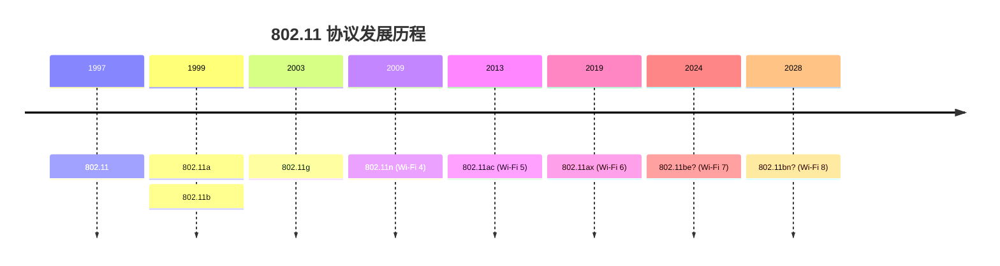

本节内容主要是对wi-fi协议（也就是802.11协议）的发展历史进行概要的分析

## 802.11-1997

第一版802.11协议， 涉及的内容有

- 无线局域网架构介绍
- 无线局域网参考模式
- 认证方式
    - 开放系统认证
    - 共享密钥认证
- WEP加密
- MAC层功能
    - MAC架构
        - DCF
        - PCF
    - 分片与去分片功能
    - 多速率支持
    - 同步（TSF）
    - 节能机制
    - 关联与重关联

- PHY层功能：
    - FHSS PHY
    - DSSS PHY
    - IR PHY

## 802.11a-1999

在第一版802.11-1997协议的基础上，新增了支持OFDM PHY层， 其他没有变化

- PHY层
    - OFDM PHY

## 802.11g-2023

DSSS PHY层做了扩展，支持5.5M、11M， 同时2.4G支持OFDM PHY

- PHY层功能:
    - HR/DSSS PHY
    - Extended Rata PHY (ERP)

## 802.11n-2009

新增的主要特性：
- 40M带宽
- MIMO（最大支持4x4）
- 支持A-MSDU和A-MPDU
- 支持tx beamforming
- 支持STBC

